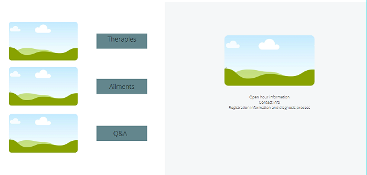

# Website for rehabilitation clinic

Originally it was my 1st milestone project done during study software development/full stack web development in [code institute](https://codeinstitute.net/)

While studying, my schedule was very tight and I didn't do everything according to my ideas. Now that I have more free time, I decided to go back to my projects and do them according to my vision.

The project is a website for a physiotherapy clinic.

Table of Contents:

1. [Website mockups and demo](#demo)
2. [UX design](##ux)
    *   [User Stories](###user-stories)
    *   [Strategy](###strategy)
    *   [Scope](###scope)
    *   [Structure](###structure)
    *   [Skeleton](###skeleton)
    *   [Surface](###surface)
3. [Technologies used on webpage](##technologies)

## Demo
 A live website can be found [here]().

## UX
### User stories

#### Clinic owner: 
I would like to be visible on the internet so that more people could reach me. I want to make people realize that they do not have to live with pain and I am here to help them.

#### Clinic patient: 
When I visit the website I would like to see that this is the place where I can find help for my ailments. I want the power to quickly find an address and a method of contact. It is important to me whether my problem will be solved, what the therapy looks like and what the prices are.
### Strategy

It is a going to be company/ therapist website for local city clients. The main goal of the web is to raise number of patients. They are the local people with back and joint injuries. Audience are mostly the people in age 30-60 from different culture, they do different jobs, but many often time is a sitting position job - drivers, office people. They are suffering for back, spin and muscles pains, but also people with posture defects. Audience are looking for therapy, they want to know what treatments are in the clinic, they want to see good references about. It is important for users to know how to found clinic and how to make a visit.

My goal in design is to make an minimalist, modern and user-friendly website. 

### Scope
Based on the user stories i describe few points of what information needs to be visible on the webpage:

1.  The information that this is the rehabilitation clinic website and user can solved issue with pain.
2.  Address and phone number.
3.  Open hours.
3.  Registration method and diagnosis. 
4.  Therapies and prices.
5.  Ailments treated in the clinic.
6.  Patients recommendations.

### Structure

### Skeleton
Desktop wireframes:

Mobile wireframes:

### Surface
Different green color type was choosen due to colors of clinic logo.

## Technologies

1. HTML
2. CSS
3. Bootstrap (4.4.0)
4. Favicons
5. Google Fonts
6. [Lightbox2](https://lokeshdhakar.com/projects/lightbox2/)
7. collapse by Bootstrap
8. Menu by bootstrap.

## Features
This site is a one page site. Sections are splitted by different full height pictures. Navigation bar is collapsed and is opened in top in row direction on big screens and column direction in small screens. Each section has a background picture or use the picture from home section.

## Testing

Performance test done in [PageSpeedInsights](https://developers.google.com/speed/pagespeed/insights/) with result of 97 for mobile and 99 for desktop.

I test all links by myself.

Using of website was tested by Ewelina, my wife and people in slack. I've got good feedback which shows me issues to solve. Some of the comments and solutions i place below. Due to lack of hardware i couldn't test it on the very big screen.
Mobile tests was done in Android 9.
Desktop tests was done in google chrome 79.0.3945.88, firefox 71.0, microsoft edge 10, and safari 5.1.7. 
Test in safari browser was failed. 
Microsoft Edge test result: If menu is open in section it is stay there, is not moving to the section above, but is moving to the section below.

1. Mobile version:

User1: Links in footer are different than in navigation bar, Contact link in footer doesn't work.

User2: White background below logo looks odd. Maybe is good to remove it and change font for bigger instead. - Done and looks really better.
The address information on white background in contact/map section is to big, could be better without it. - Done and it is better.

User3: The drop down menu, it’s nice, works lovely.... but the colour scheme is very similar to some of the background images. When you click on the options, moving on the main page, it makes reading the menu options hard and so. - solution implemented - change the menu color for not transparent and it is looks better.

User4: Images in gallery are so small. - implemented the lightbox to solve it.

2. Desktop version:

User1: In recommandation section is a lot of empty space. - solved by remove restriction of section height.

User2: Map picture is small if compare to the gallery pictures.

User3: Types of treatments in for who section are opened all ugly, maybe will be better to have close one when other is opening. - solved.

## Deployment
This site is hosted using GitHub pages, deployed directly from the master branch. The deployed site will update automatically upon new commits to the master branch. In order for the site to deploy correctly on GitHub pages, the landing page must be named `index.html`.

To run locally, you can clone this repository directly into the editor of your choice by pasting `git clone https://github.com/dejvoss/code-inst-ms1-project.git` into your terminal.

## Content
All content in the "For whom" and "Treatments" sections in this website were taken from google and wikipedia. 
All content in the "Recommendations" sections were taken from google place recommendation.

## Media
All photos were taken from [secret stock 99](https://shop.stockphotosecrets.com/), a stock image library.

## Acknowledgements
The Lightbox was suggested by my mentor and applied from [here](https://lokeshdhakar.com/projects/lightbox2/)

The navigation bar, collapsed cards in for whom section and cards in treatment section was taken from [here](https://getbootstrap.com/docs/4.4/getting-started/introduction/)

